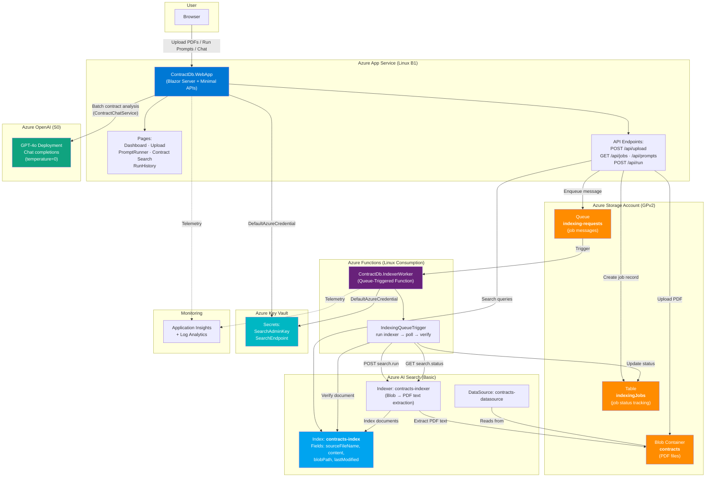
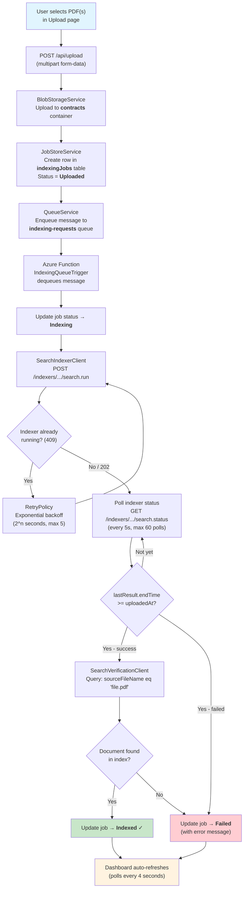
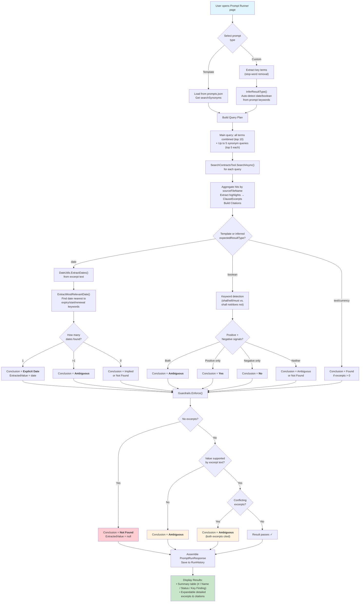
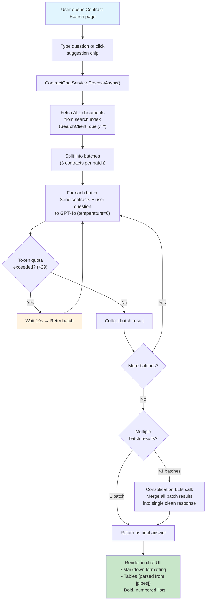
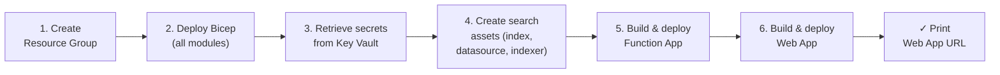

# ContractDB Prompt Runner

End-to-end contract analysis solution built entirely in **C#** across all tiers: **Blazor Web App** for the UI, **ASP.NET Core Minimal APIs** for the backend, **Azure Functions (C# isolated worker)** for indexing orchestration, **Azure AI Search** as the retrieval engine, and **Azure OpenAI (GPT-4o)** for intelligent contract analysis.

Users upload PDF contracts → the system indexes them via Azure AI Search blob indexer → then users can:

1. **Prompt Runner** — Run approved templates or custom prompts with rule-based extraction, summary table output, and auditable citations
2. **Contract Search (AI Chat)** — Ask natural-language questions across **all** contracts; the system fetches every document, processes them in batches through GPT-4o (temperature=0 for deterministic results), and consolidates a single precise answer

All Azure access is **identity-based** using `DefaultAzureCredential` — no shared keys or connection strings are stored in app settings.

---

## Architecture Diagram



---

## Indexing Workflow Flowchart



---

## Prompt Execution Flowchart



---

## Contract Search (AI Chat) Flowchart



---

## Repository Structure

```
ContractSearchApp/
│
├── infra/                              Azure Bicep IaC
│   ├── main.bicep                      Orchestrator (all modules + 12 RBAC assignments)
│   ├── main.parameters.json            Default parameters (baseName, location)
│   └── modules/
│       ├── storage.bicep               Storage Account: Blob + Queue + Table (identity-based)
│       ├── search.bicep                Azure AI Search (Basic SKU)
│       ├── openai.bicep                Azure OpenAI (S0) + GPT-4o deployment
│       ├── function.bicep              Function App (Linux Consumption)
│       ├── webapp.bicep                App Service (Linux B1) + OpenAI config
│       ├── keyvault.bicep              Key Vault (RBAC, secrets)
│       └── monitoring.bicep            Log Analytics + Application Insights
│
├── scripts/
│   ├── deploy.ps1 / deploy.sh          Full deployment orchestrator
│   ├── create-search-assets.ps1/.sh    Creates index, data source, indexer
│   └── seed-sample-data.ps1/.sh        Uploads sample PDFs for testing
│
├── src/
│   ├── ContractDb.sln                  Solution file (3 projects)
│   │
│   ├── ContractDb.Shared/              Shared class library (.NET 8)
│   │   ├── Models/
│   │   │   ├── JobModels.cs            IndexingJob, JobStatus, JobsSummary, IndexingQueueMessage
│   │   │   ├── PromptModels.cs         PromptTemplate, PromptRunRequest/Response, PromptResult, Citation
│   │   │   └── SearchModels.cs         SearchHit, SearchQuery, SearchResponse
│   │   └── Services/
│   │       ├── PromptLibraryLoader.cs  Loads prompt templates from JSON
│   │       ├── Guardrails.cs           Enforces no-guess, ambiguity, citation rules
│   │       ├── DateUtils.cs            Regex date extraction (8 formats)
│   │       └── CitationUtils.cs        Excerpt extraction + citation builder
│   │
│   ├── ContractDb.PromptLibrary/       Non-code prompt assets
│   │   ├── prompts.json                11 templates: Section A, B, Master
│   │   ├── promptGroups.json           Logical groupings
│   │   └── schemas/resultSchemas.json  JSON schema for output validation
│   │
│   ├── ContractDb.WebApp/              Blazor Web App + Minimal APIs
│   │   ├── Program.cs                  DI setup + 8 API endpoints + OpenAI client
│   │   ├── appsettings.json            Configuration keys
│   │   ├── Pages/
│   │   │   ├── Dashboard.razor         / — summary cards + jobs table (auto-refresh)
│   │   │   ├── Upload.razor            /upload — multi-file PDF upload
│   │   │   ├── PromptRunner.razor      /prompt-runner — template/custom prompts with summary table
│   │   │   ├── ContractChat.razor      /contract-chat — AI-powered chat search (GPT-4o)
│   │   │   └── RunHistory.razor        /run-history — past run details
│   │   ├── Components/
│   │   │   ├── Layout/MainLayout.razor App shell with sidebar navigation
│   │   │   ├── StatusBadge.razor       Color-coded job status
│   │   │   ├── PromptPicker.razor      Grouped template dropdown
│   │   │   ├── PromptEditor.razor      Custom prompt textarea
│   │   │   ├── ScopeSelector.razor     All contracts vs single file
│   │   │   ├── ResultsTable.razor      Per-contract results table
│   │   │   ├── CitationViewer.razor    Quoted excerpts + source info
│   │   │   ├── UploadDropzone.razor    Drag-and-drop file input
│   │   │   ├── UploadQueueTable.razor  Upload status tracking
│   │   │   └── ExportButtons.razor     JSON/CSV export
│   │   └── Services/
│   │       ├── BlobStorageService.cs   Upload PDFs to Blob (identity-based)
│   │       ├── JobStoreService.cs      CRUD jobs in Table Storage (identity-based)
│   │       ├── QueueService.cs         Enqueue indexing messages (Base64 + identity-based)
│   │       ├── SearchContractsTool.cs  Azure AI Search query wrapper (sole retrieval path)
│   │       ├── SearchAdminService.cs   Run indexer + get status (REST)
│   │       ├── PromptExecutionService.cs  Query plan + auto-type inference + extraction + guardrails
│   │       ├── ContractChatService.cs  LLM-powered chat: batch all contracts through GPT-4o
│   │       └── RunHistoryService.cs    In-memory run history
│   │
│   └── ContractDb.IndexerWorker/       Azure Functions (C# isolated worker)
│       ├── Program.cs                  HostBuilder + Key Vault secrets
│       ├── host.json                   Queue config (batch=1, 5s poll, 5m visibility)
│       ├── Functions/
│       │   └── IndexingQueueTrigger.cs Queue trigger: run → poll → verify → update
│       └── Services/
│           ├── SearchIndexerClient.cs  REST API: run indexer + get status
│           ├── SearchVerificationClient.cs  Verify document in index
│           ├── JobStoreClient.cs       Update job status in Table (identity-based)
│           └── RetryPolicy.cs          Exponential backoff (2^n sec)
│
├── .github/workflows/
│   └── deploy.yml                      CI/CD: build → deploy Bicep → deploy apps
│
└── README.md                           This file
```

---

## Prerequisites

| Tool | Version | Required For |
|------|---------|-------------|
| [.NET 8 SDK](https://dot.net/download) | 8.0+ | Building all C# projects |
| [Azure CLI](https://aka.ms/installazurecli) | 2.50+ | Deployment + resource management |
| [Azure Functions Core Tools](https://aka.ms/azfunc-install) | v4 | Local Function App development |
| Azure Subscription | — | Hosting all resources |
| [Azurite](https://learn.microsoft.com/azure/storage/common/storage-use-azurite) | Latest | Local Storage emulator (optional) |

---

## Deployment Guide

### Option A: One-Command Deployment (Recommended)

The deployment script handles everything: infrastructure, search assets, and application deployment.

**Windows (PowerShell):**

```powershell
# Login to Azure
az login

# Deploy everything
./scripts/deploy.ps1 -ResourceGroup contractdb-rg -Location eastus -BaseName contractdb
```

**Linux / macOS (Bash):**

```bash
az login
bash scripts/deploy.sh contractdb-rg eastus contractdb
```

**What the script does (6 steps):**



**Deployment outputs:**

| Output | Description |
|--------|-------------|
| `webAppUrl` | Public URL of the Blazor Web App |
| `searchEndpoint` | Azure AI Search endpoint |
| `storageAccountName` | Storage account name |
| `keyVaultName` | Key Vault name |
| `functionAppName` | Function App name |
| `openAiEndpoint` | Azure OpenAI endpoint |
| `openAiName` | Azure OpenAI resource name |

### Option B: Step-by-Step Manual Deployment

#### Step 1: Deploy Infrastructure

```bash
# Create resource group
az group create --name contractdb-rg --location eastus

# Deploy all Azure resources via Bicep
az deployment group create \
  --resource-group contractdb-rg \
  --template-file infra/main.bicep \
  --parameters baseName=contractdb location=eastus
```

#### Step 2: Create Search Assets

Retrieve the necessary secrets, then create the index, data source, and indexer:

```powershell
# Get values from outputs / Key Vault
$endpoint = az deployment group show -g contractdb-rg -n main --query properties.outputs.searchEndpoint.value -o tsv
$kvName   = az deployment group show -g contractdb-rg -n main --query properties.outputs.keyVaultName.value -o tsv
$adminKey = az keyvault secret show --vault-name $kvName --name SearchAdminKey --query value -o tsv
$connStr  = az keyvault secret show --vault-name $kvName --name StorageConnectionString --query value -o tsv

# Create index + data source + indexer + run initial indexing
./scripts/create-search-assets.ps1 `
  -SearchEndpoint $endpoint `
  -SearchAdminKey $adminKey `
  -StorageConnectionString $connStr
```

**Search assets created:**

| Asset | Name | Purpose |
|-------|------|---------|
| Index | `contracts-index` | Fields: `id` (key), `sourceFileName`, `blobPath`, `content`, `lastModified` |
| Data Source | `contracts-datasource` | Azure Blob → `contracts` container |
| Indexer | `contracts-indexer` | Blob indexer: PDF text extraction, field mappings, on-demand schedule |

#### Step 3: Deploy Function App

```bash
cd src/ContractDb.IndexerWorker
dotnet publish -c Release -o ./publish
cd publish && zip -r ../deploy.zip .
az functionapp deployment source config-zip \
  --resource-group contractdb-rg \
  --name contractdb-func \
  --src ../deploy.zip
cd .. && rm -rf publish deploy.zip
```

#### Step 4: Deploy Web App

```bash
cd src/ContractDb.WebApp
dotnet publish -c Release -o ./publish
cd publish && zip -r ../deploy.zip .
az webapp deploy \
  --resource-group contractdb-rg \
  --name contractdb-web \
  --src-path ../deploy.zip \
  --type zip
cd .. && rm -rf publish deploy.zip
```

#### Step 5: Verify

Open the Web App URL (from deployment output) in a browser. You should see the Dashboard page.

### Option C: CI/CD via GitHub Actions

The `.github/workflows/deploy.yml` workflow automates build + deploy on push to `main`.

**Required GitHub Secrets:**

| Secret | Description |
|--------|-------------|
| `AZURE_CLIENT_ID` | Service principal client ID (federated credential) |
| `AZURE_TENANT_ID` | Azure AD tenant ID |
| `AZURE_SUBSCRIPTION_ID` | Target subscription ID |

---

## Local Development Setup

### 1. Start Azurite (Local Storage Emulator)

```bash
# Install and run Azurite for local Blob, Queue, and Table emulation
npm install -g azurite
azurite --silent --location ./azurite-data
```

### 2. Configure & Run the Web App

```bash
cd src/ContractDb.WebApp
```

Create `appsettings.Development.json`:

```json
{
  "StorageAccountName": "your-storage-account-name",
  "SearchEndpoint": "https://your-search-service.search.windows.net",
  "SearchAdminKey": "your-admin-key",
  "AzureOpenAiEndpoint": "https://your-openai.openai.azure.com/",
  "AzureOpenAiDeployment": "gpt-4o",
  "SearchIndexName": "contracts-index",
  "IndexerName": "contracts-indexer",
  "BlobContainerName": "contracts",
  "QueueName": "indexing-requests",
  "TableName": "indexingJobs",
  "PromptLibraryPath": "PromptLibrary"
}
```

```bash
dotnet run
# Opens at https://localhost:5001
```

### 3. Configure & Run the Function App

```bash
cd src/ContractDb.IndexerWorker
cp local.settings.json.example local.settings.json
# Edit local.settings.json with your Search endpoint + admin key
```

```bash
func start
# Or: dotnet run
```

### 4. Upload Sample PDFs (Optional)

```powershell
./scripts/seed-sample-data.ps1 -StorageConnectionString "UseDevelopmentStorage=true"
```

Place sample PDFs in a `samples/` folder at the repo root before running.

---

## API Reference

All endpoints are Minimal APIs hosted in `ContractDb.WebApp/Program.cs`.

### Upload

```
POST /api/upload
Content-Type: multipart/form-data
Body: one or more PDF files

Response 200: IndexingJob[]
  [{ "jobId": "guid", "fileName": "contract.pdf", "blobPath": "https://...", "status": "Uploaded", ... }]
```

### Jobs

```
GET /api/jobs                → IndexingJob[]     (all jobs, newest first)
GET /api/jobs/{jobId}        → IndexingJob        (single job, 404 if not found)
GET /api/jobs/summary        → JobsSummary        (counts by status + indexed doc total)
```

**JobsSummary response:**

```json
{
  "totalJobs": 15,
  "queued": 0,
  "uploaded": 1,
  "indexing": 2,
  "indexed": 11,
  "failed": 1,
  "indexedDocumentCount": 11
}
```

### Prompts

```
GET /api/prompts → { "templates": PromptTemplate[], "groups": PromptGroup[] }
```

### Run Prompt

```
POST /api/run
Content-Type: application/json
Body: {
  "promptId": "A01",            // OR use customPromptText
  "customPromptText": null,
  "scope": "all",               // or specific filename
  "scopeFileName": null
}

Response 200: PromptRunResponse
  {
    "runId": "guid",
    "promptText": "What is the effective date...",
    "scope": "all",
    "executedAt": "2026-03-13T...",
    "results": [{
      "contractName": "MasterServiceAgreement",
      "sourceFileName": "MasterServiceAgreement.pdf",
      "clauseExcerpts": [{ "text": "This Agreement is effective as of January 1, 2025", "score": 4.2 }],
      "extractedValue": "2025-01-01",
      "conclusion": "Explicit Date",
      "citations": [{
        "sourceFileName": "MasterServiceAgreement.pdf",
        "blobPath": "https://.../contracts/MasterServiceAgreement.pdf",
        "excerpt": "This Agreement is effective as of January 1, 2025",
        "queryUsed": "effective date commencement date start date"
      }]
    }],
    "totalContracts": 5,
    "matchedContracts": 3
  }
```

### Run History

```
GET /api/runs                → PromptRunResponse[]  (all runs, newest first)
GET /api/runs/{runId}        → PromptRunResponse     (single run, 404 if not found)
```

---

## Prompt Library

Prompts are defined in `src/ContractDb.PromptLibrary/prompts.json`, organized by priority:

### Section A — Priority Contract Terms

| ID | Prompt | Expected Type | Search Synonyms |
|----|--------|---------------|-----------------|
| A01 | Contract Effective Date | `date` | effective date, commencement date, start date, agreement date |
| A02 | Contract Expiration Date | `date` | expiration date, termination date, end date, expires on |
| A03 | Auto-Renewal Clause | `boolean` | auto-renewal, automatic renewal, evergreen, successive periods |
| A04 | Termination for Convenience | `text` | termination for convenience, terminate without cause, notice period |
| A05 | Governing Law | `text` | governing law, jurisdiction, laws of the state, governed by |

### Section B — Extended Contract Terms

| ID | Prompt | Expected Type |
|----|--------|---------------|
| B01 | Limitation of Liability | `text` |
| B02 | Indemnification Clause | `text` |
| B03 | Confidentiality / NDA | `text` |
| B04 | Payment Terms | `text` |
| B05 | Insurance Requirements | `text` |

### Master

| ID | Prompt | Expected Type |
|----|--------|---------------|
| M01 | Full Contract Summary | `text` |

**Adding new prompts:** Add entries to `prompts.json` with a unique `id`, `section` (A/B/Master), `searchSynonyms` list, and `expectedResultType` (text/date/boolean/currency).

---

## Guardrails & Audit Requirements

The system enforces strict audit rules to ensure trustworthy output:

| Rule | Behavior |
|------|----------|
| **No guessing** | If no excerpt supports a value, `ExtractedValue = null` and `Conclusion = Not Found` |
| **Ambiguous detection** | If conflicting excerpts exist (score variance > 50%), `Conclusion = Ambiguous` with both excerpts cited |
| **Always cite** | Every result includes `ClauseExcerpts` (quoted text) and `Citations` (source file, blob path, query used) |
| **Extract only from text** | Values are extracted only if explicitly present in the excerpt; never inferred |
| **Unsupported value check** | If `ExtractedValue` doesn't appear in any excerpt text, it's cleared and marked `Ambiguous` |

**Conclusion values by type:**

| Expected Type | Possible Conclusions |
|---------------|---------------------|
| `date` | `Explicit Date` · `Implied` · `Not Found` · `Ambiguous` |
| `boolean` | `Yes` · `No` · `Ambiguous` · `Not Found` |
| `text` / `currency` | `Found` · `Not Found` · `Ambiguous` |

---

## Azure Resources

| Resource | Bicep Module | SKU | Purpose |
|----------|-------------|-----|---------|
| Storage Account (GPv2) | `storage.bicep` | Standard_LRS | Blob (`contracts`), Queue (`indexing-requests`), Table (`indexingJobs`). Identity-based access only (`allowSharedKeyAccess: false`) |
| Azure AI Search | `search.bicep` | Basic | Full-text search index + blob indexer for PDF extraction |
| Azure OpenAI | `openai.bicep` | S0 | GPT-4o deployment for AI-powered contract chat analysis |
| Function App | `function.bicep` | Y1 Dynamic (Linux) | Queue-triggered indexer worker with managed identity |
| App Service | `webapp.bicep` | B1 (Linux) | Blazor Web App + Minimal APIs with managed identity |
| Key Vault | `keyvault.bicep` | Standard | Stores `SearchAdminKey` and `SearchEndpoint` (RBAC-enabled) |
| Log Analytics | `monitoring.bicep` | PerGB2018 | Centralized log workspace (30-day retention) |
| Application Insights | `monitoring.bicep` | — | APM telemetry for both Web App and Function App |

### RBAC Role Assignments (12 total, resource-scoped)

| Principal | Role | Scope |
|-----------|------|-------|
| Web App | Key Vault Secrets User | Key Vault |
| Function App | Key Vault Secrets User | Key Vault |
| Deployer | Key Vault Secrets Officer | Key Vault |
| Function App | Storage Blob Data Owner | Storage Account |
| Function App | Storage Queue Data Contributor | Storage Account |
| Function App | Storage Table Data Contributor | Storage Account |
| Web App | Storage Blob Data Owner | Storage Account |
| Web App | Storage Queue Data Contributor | Storage Account |
| Web App | Storage Table Data Contributor | Storage Account |
| Search Service | Storage Blob Data Reader | Storage Account |
| Deployer | Storage Blob Data Owner | Storage Account |
| Web App | Cognitive Services OpenAI User | Azure OpenAI |

---

## Security

| Control | Implementation |
|---------|----------------|
| **Identity-Based Access** | All storage access uses `DefaultAzureCredential` — no shared keys (`allowSharedKeyAccess: false`) |
| **Managed Identity** | System-assigned identity on Function App, Web App, and Search Service |
| **Key Vault RBAC** | Apps granted `Key Vault Secrets User` role; deployer gets `Secrets Officer`. Resource-scoped assignments |
| **Secrets Management** | Only `SearchAdminKey` and `SearchEndpoint` stored in Key Vault. No connection strings |
| **Azure OpenAI RBAC** | Web App granted `Cognitive Services OpenAI User` — no API keys stored |
| **HTTPS Only** | Enforced on all App Service and Function App resources |
| **TLS 1.2** | Minimum TLS version set to 1.2 |
| **No Public Blob Access** | Blob container `publicAccess: None` |
| **Queue Encoding** | `QueueMessageEncoding.Base64` on both sender and receiver (required by Functions runtime) |
| **Antiforgery** | Enabled by default; CSRF-exempt only on upload and run endpoints (API-style) |
| **File Validation** | Only `.pdf` files accepted; file names sanitized via `Path.GetFileName()` |
| **Upload Limit** | 100 MB max per file |

---

## Configuration Reference

### Web App (`appsettings.json`)

| Key | Required | Description |
|-----|----------|-------------|
| `StorageAccountName` | Yes | Storage account name for identity-based access via `DefaultAzureCredential` |
| `SearchEndpoint` | Yes | Azure AI Search endpoint URL |
| `SearchAdminKey` | Yes | Search admin key (loaded from Key Vault at startup) |
| `AzureOpenAiEndpoint` | Yes | Azure OpenAI endpoint URL for Contract Search chat |
| `AzureOpenAiDeployment` | No | OpenAI model deployment name (default: `gpt-4o`) |
| `SearchIndexName` | No | Index name (default: `contracts-index`) |
| `IndexerName` | No | Indexer name (default: `contracts-indexer`) |
| `KeyVaultUri` | No | If set, secrets loaded from Key Vault via managed identity |
| `BlobContainerName` | No | Blob container (default: `contracts`) |
| `QueueName` | No | Queue name (default: `indexing-requests`) |
| `TableName` | No | Table name (default: `indexingJobs`) |
| `PromptLibraryPath` | No | Path to prompt JSON files (default: `PromptLibrary`) |

### Function App (`local.settings.json`)

| Key | Required | Description |
|-----|----------|-------------|
| `AzureWebJobsStorage__accountName` | Yes | Storage account name for identity-based queue trigger binding |
| `FUNCTIONS_WORKER_RUNTIME` | Yes | Must be `dotnet-isolated` |
| `KeyVaultUri` | Yes* | Key Vault URI for secrets (*or set `SearchEndpoint`/`SearchAdminKey` directly) |
| `IndexerName` | No | Indexer name (default: `contracts-indexer`) |
| `SearchIndexName` | No | Index name (default: `contracts-index`) |
